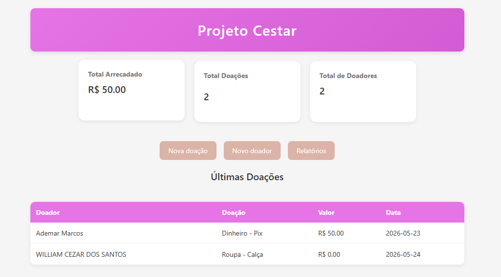
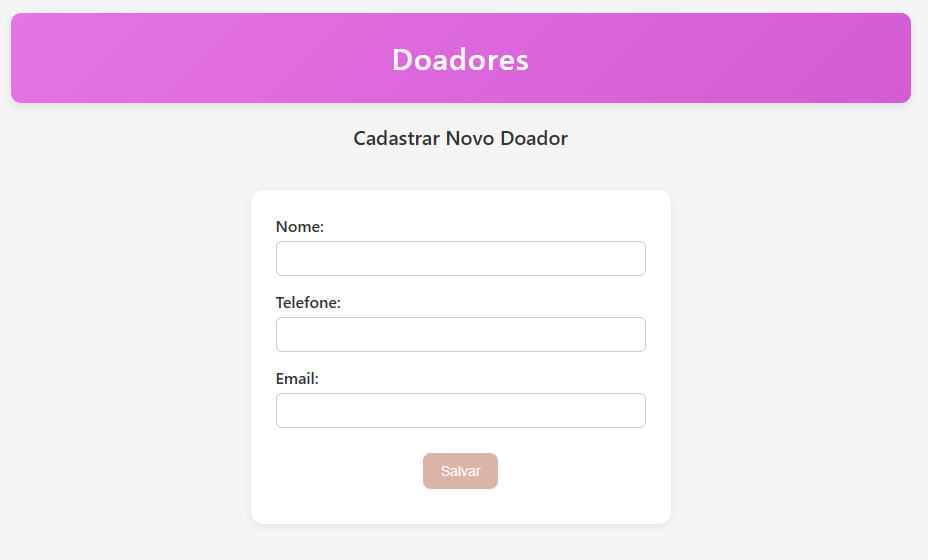
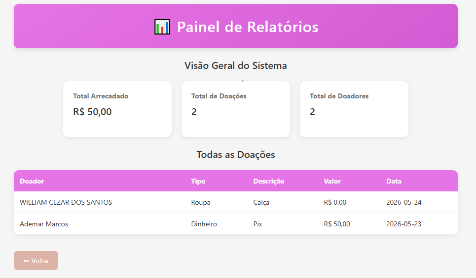

# Sistema de Gerenciamento de Doações 🎁

Este sistema web foi desenvolvido sob medida para resolver um problema real de organização do *Projeto Cestar*, uma iniciativa beneficente que enfrentava dificuldades no controle e gerenciamento manual dos dados de suas arrecadações e doações. 

O objetivo principal da aplicação é automatizar esse processo, oferecendo uma solução simples e eficiente para registrar quem doou, o que foi doado e quando a ação aconteceu, facilitando a gestão estratégica das ações sociais do projeto.

---

## 📸 Demonstração

Aqui você pode visualizar a interface do sistema (substitua os caminhos abaixo pelas suas imagens):





---

## 🚀 Funcionalidades

* **Cadastro de Doações:** Registro de doadores, itens ou valores doados.
* **Controle de Datas:** Organização cronológica para acompanhar o fluxo de arrecadações.
* **Visualização Rápida:** Painel limpo e responsivo para consulta dos dados cadastrados.

---

## 🛠️ Tecnologias Utilizadas

O projeto foi construído utilizando tecnologias web fundamentais, focando em leveza e performance:

* **Front-end:** HTML5, CSS3 e JavaScript.
* **Back-end:** PHP
* **Banco de Dados:** MySQL

---

## 📦 Como Executar o Projeto Localmente

### Pré-requisitos
Para rodar o projeto em sua máquina, você precisará de um ambiente de servidor local que suporte PHP e MySQL (como **XAMPP**, **WampServer** ou **Laragon**).

### Passo a Passo
1. Clone este repositório:
   ```bash
   git clone [https://github.com/Devwillsantos/donation-manager.git](https://github.com/Devwillsantos/donation-manager.git)
